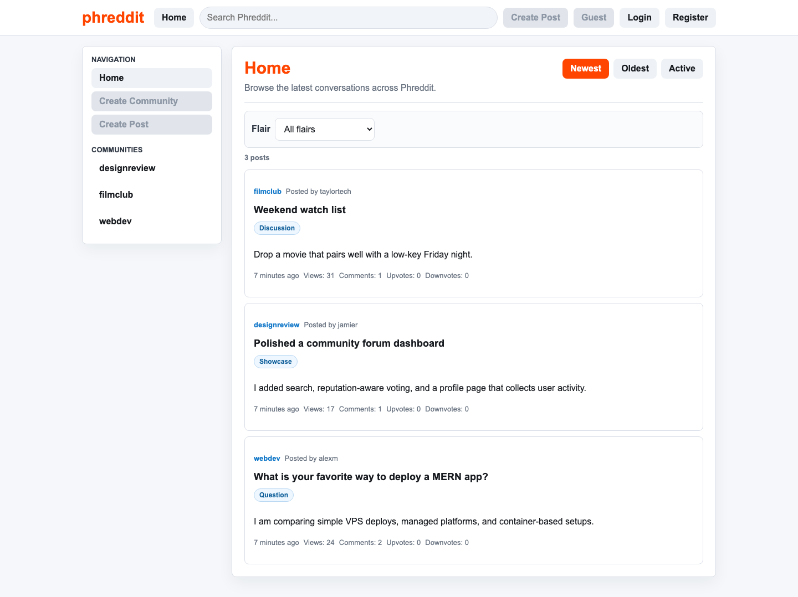
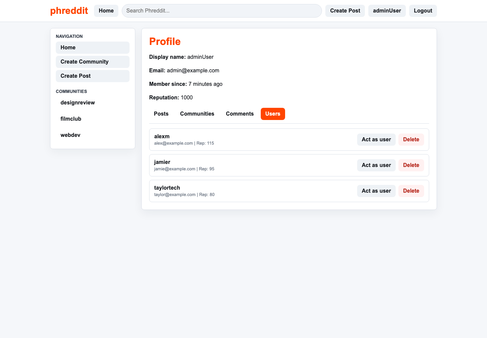

# Phreddit

[](https://github.com/rish-rm/phreddit/actions/workflows/ci.yml)

Phreddit is a full-stack Reddit-inspired community forum built with React, Express, MongoDB, and Mongoose. It supports guest browsing, session-based accounts, communities, posts, link flair, threaded comments, saved posts, reputation-aware voting, user reporting, profile management, and admin moderation flows.

The project is structured as a portfolio-ready MERN application with a polished responsive UI, isolated backend integration tests, and Playwright coverage for core browser workflows.

## Screenshots





## Features

- Guest browsing plus registration, login, logout, and persisted sessions
- Persistent app banner and sidebar navigation across main app views
- Community creation, membership, listings, and joined-community prioritization
- Post creation, editing, deletion, flair display, flair filtering, and search
- Newest, Oldest, and Active sorting, with Active based on latest comment activity
- Threaded comments and replies with recursive display
- Post/comment voting with one-vote-per-user and reputation restrictions
- Saved posts/bookmarks with a dedicated profile tab
- Post reporting with duplicate-report protection and an admin moderation queue
- Admin report resolution through dismissal or content removal
- User profiles for posts, comments, and communities with edit/delete controls
- Admin user list, acting as another user's profile, and cascade user deletion
- Cascade deletion for communities, posts, comments, replies, and user-owned content
- In-memory auth rate limiting for login/register abuse prevention
- Responsive layout, keyboard-visible focus states, empty/loading/error states
- Unit, integration, and Playwright e2e tests

## Tech Stack

- React 18 and Vite
- Express 4
- MongoDB and Mongoose
- bcrypt password hashing
- express-session with optional Mongo-backed session store
- Node test runner, Supertest, ESLint
- Playwright for browser e2e tests

## Project Structure

```text
phreddit/
├── .github/workflows/      # CI for lint, build, unit, integration, and e2e checks
├── client/
│   ├── e2e/                 # Playwright browser tests
│   ├── public/
│   └── src/
│       ├── api/             # Fetch wrapper and API contracts
│       ├── components/      # Shared shell, navigation, cards, comments
│       ├── pages/           # App views
│       └── utils/           # Formatting and post sorting/count helpers
├── images/
│   ├── screenshots/         # README screenshots
│   └── *.png                # Architecture diagrams
├── server/
│   ├── middleware/          # Auth/session helpers
│   ├── models/              # Mongoose schemas
│   ├── routes/              # Express API routes
│   ├── tests/               # Unit and integration tests
│   ├── utils/               # Validation, voting, cascade deletion, stats
│   ├── init.js              # Seed/admin initialization script
│   └── server.js            # App factory and server entrypoint
├── package.json             # Root convenience scripts
└── README.md
```

## Setup

Requirements:

- Node.js 20.19 or newer
- npm
- MongoDB running locally

Install dependencies from the repo root:

```bash
npm run install:all
```

Create optional environment files:

```bash
cp server/.env.example server/.env
cp client/.env.example client/.env
```

Initialize the database with an admin user and demo content:

```bash
MONGO_URI=mongodb://127.0.0.1:27017/phreddit \
  node server/init.js admin@example.com adminUser AdminPass123!
```

Start the backend:

```bash
npm --prefix server start
```

Start the frontend in another terminal:

```bash
npm --prefix client run dev
```

Open `http://127.0.0.1:5173`.

## Demo Accounts

The seed script creates the admin account from the command line:

- Email: `admin@example.com`
- Display name: `adminUser`
- Password: `AdminPass123!`

It also creates demo users with the password `DemoPass123!`:

- `alex@example.com`
- `jamie@example.com`
- `taylor@example.com`

## Environment Variables

Server:

- `MONGO_URI`: MongoDB connection string. Defaults to `mongodb://127.0.0.1:27017/phreddit`.
- `PORT`: API port. Defaults to `8000`.
- `SESSION_SECRET`: Secret used by `express-session`.
- `CLIENT_ORIGIN`: Comma-separated allowed browser origins for CORS.
- `SESSION_COOKIE_SAMESITE`: Cookie SameSite mode. Defaults to `lax`.
- `SESSION_COOKIE_SECURE`: Set to `true` for HTTPS cookie delivery.
- `JSON_BODY_LIMIT`: Express JSON body limit. Defaults to `1mb`.
- `AUTH_RATE_LIMIT_WINDOW_MS`: Login/register rate-limit window. Defaults to 15 minutes.
- `AUTH_RATE_LIMIT_MAX`: Login/register attempts per window. Defaults to `20`.
- `DISABLE_RATE_LIMIT`: Set to `true` only for trusted local/debug scenarios.
- `ENABLE_TEST_AUTH_HEADER`: Set to `true` only in a trusted test harness to accept `x-test-user-id`; production should leave this unset.

Client:

- `VITE_API_BASE_URL`: Optional API base URL. Local development normally uses the Vite `/api` proxy.

Testing:

- `TEST_MONGO_URI`: Base MongoDB URI for integration tests. Each test process derives a unique database name from this URI.
- `E2E_MONGO_URI`: MongoDB URI used by the Playwright web-server setup.

## Deployment

The frontend can deploy to Vercel from the repository root. `vercel.json` installs the `client` package, builds the Vite app, serves `client/dist`, and rewrites client-side routes to `index.html`.

For a fully working public app, deploy the API and database separately:

- MongoDB Atlas or another hosted MongoDB provider for `MONGO_URI`
- A Node web service for `server/` with build command `npm ci` and start command `npm start`
- Vercel environment variable `VITE_API_BASE_URL=https://your-api.example.com/api`
- API environment variables `CLIENT_ORIGIN=https://your-vercel-app.vercel.app`, `SESSION_COOKIE_SAMESITE=none`, `SESSION_COOKIE_SECURE=true`, and a strong `SESSION_SECRET`

## Scripts

From the repo root:

```bash
npm run install:all
npm run lint
npm run lint:server
npm run lint:client
npm run build
npm run test:unit
npm run test:int
npm run test:e2e
```

Equivalent package-level commands:

```bash
npm --prefix server run lint
npm --prefix server run test:unit
npm --prefix server run test:int
npm --prefix client run lint
npm --prefix client run build
npm --prefix client run test:e2e
```

For integration and e2e tests, run MongoDB first. Example with an isolated local MongoDB instance:

```bash
mongod --dbpath /tmp/phreddit-mongo --port 27028 --bind_ip 127.0.0.1
TEST_MONGO_URI=mongodb://127.0.0.1:27028/phreddit_int npm run test:int
E2E_MONGO_URI=mongodb://127.0.0.1:27028/phreddit_e2e npm run test:e2e
```

## Architecture Notes

- `server/server.js` exports `createApp()` for testability and `startServer()` for normal runtime startup.
- Test auth can inject `x-test-user-id` only when `NODE_ENV=test` or `ENABLE_TEST_AUTH_HEADER=true`; production auth uses session cookies.
- Post listings use `server/utils/postStats.js` to attach recursive `commentCount` and `latestCommentAt` without relying on partially populated comments.
- Frontend Active sort keeps posts with comment activity above empty posts and sorts by latest comment/reply timestamp.
- Saved posts are modeled as user-to-post references and returned through profile content instead of duplicating post snapshots.
- Reports are first-class documents with a pending/resolved lifecycle, reporter identity, admin resolution metadata, and duplicate-pending-report protection.
- Admin moderation deletion reuses the same cascade deletion helper as ordinary post deletion, keeping cleanup behavior consistent across code paths.
- Login/register use a dependency-free memory rate limiter suitable for a single-node demo; a Redis-backed store would be the production scaling path.
- Deletion helpers recursively remove comments/replies and clean references from users, posts, and communities.
- User deletion also removes that user's vote records and corrects stored vote totals.
- Playwright starts the client and server automatically, runs with one worker, and uses unique test data to avoid cross-test interference.

## Portfolio Talking Points

- **Product thinking:** Phreddit goes beyond CRUD with saved posts, reporting, admin review, reputation-aware voting, and joined-community prioritization.
- **Scalable data shape:** Posts, comments, reports, communities, users, and link flairs are normalized Mongoose models with explicit reference cleanup.
- **Authorization:** Ownership checks protect edit/delete flows, admins get elevated review/user-management capabilities, and guests stay read-only.
- **Reliability:** GitHub Actions runs lint, build, unit, integration, and e2e checks; integration tests use isolated MongoDB names per process, while Playwright runs serialized against dedicated e2e data.
- **Security:** Passwords are hashed with bcrypt, login regenerates sessions, session cookies are HTTP-only, CORS is allowlisted, input is validated, auth endpoints are rate limited, and test-only auth headers are gated away from production.
- **Accessibility/UI:** The app uses persistent navigation, semantic buttons/forms/tabs, visible focus states, responsive layout, and clear empty/error states.

## Repository Hygiene

The `.gitignore` excludes dependency folders, build output, test artifacts, environment files, database files, spreadsheets, archives, and local OS files. Do not commit:

- `node_modules/`
- `client/dist/`
- `.env`, `.env.local`, `.env.test`
- `test-results/`, `playwright-report/`
- local MongoDB data
- temporary archives or grading spreadsheets
